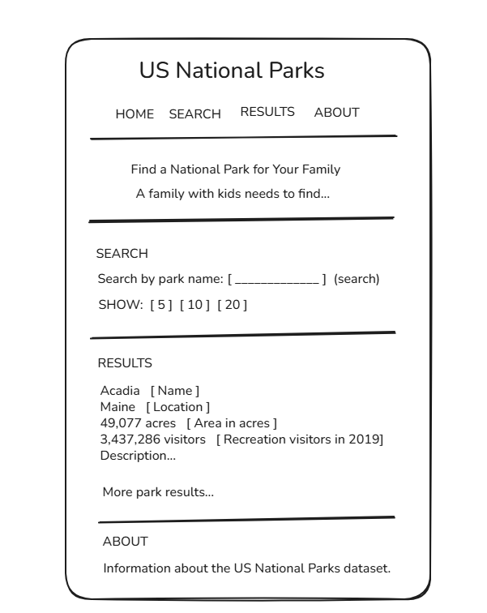

## The problem

A family with kids needs to find a national park that is good for their family because they want to choose a park that everyone in the family can enjoy. 
My page will let them search for a national park by name and show its location, size, visitor count, and description.

## The plan

### Sections

Search - A visitor can search for a national park by name and choose how many results to show.

Results - A visitor can see national park information from the data.

About the data - A visitor can see information about the national parks dataset.

## User input

A visitor types a park name and the page searches for matching national parks.

A visitor clicks 5, 10, or 20 and the page shows that number of results.

## Outputs

- Name
- Location
- Area in acres

## Data

File: `US National Parks.csv`

| Field | Example value |
| --- | --- |
| `id` | `1` |
| `Name` | Acadia |
| `Image` | https://upload.wikimedia.org/wikipedia/commons/thumb/9/93/Bass_Harbor_Head_Light_Station_2016.jpg/500px-Bass_Harbor_Head_Light_Station_2016.jpg |
| `Location` | Maine |
| `Date established` | February 26, 1919 |
| `Area in acres` | 49077.0 |
| `Recreation visitors in 2019` | 3437286.0 |
| `Description` | Covering most of Mount Desert Island and other coastal islands, Acadia features the tallest mountain on the Atlantic coast of the United States, granite peaks, ocean shoreline, woodlands, and lakes. There are freshwater, estuary, forest, and intertidal habitats. |

## Questions

1. Which national park had the most recreation visitors in 2019?
2. Which national parks have the largest area in acres?
3. Which national parks were established earliest?

## Team

Accountability partners:

- @mattwainwright-dev
- @SnDyMrn13
- @Hexaxolotl